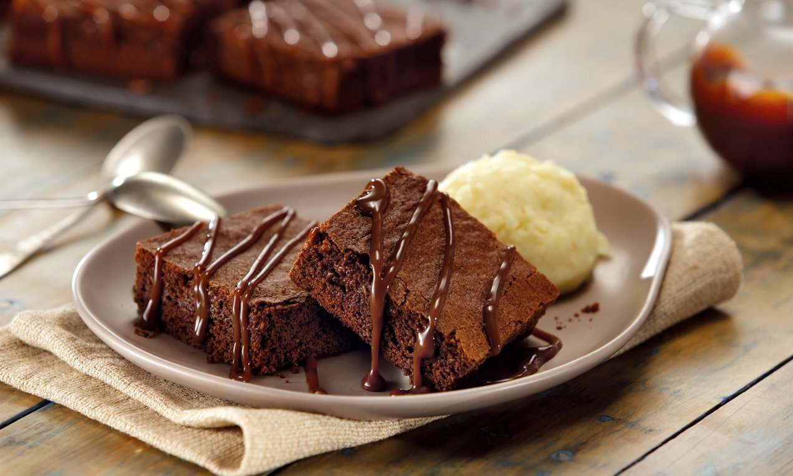

### **Brownie** :cookie:

**Ingredientes**

- 6 colheres (sopa) bem cheias, de margarina sem sal
- 3/4 xícara (chá) achocolatado
- 1/2 xícara (chá) chocolate em pó
- 1 e 1/4 xícara (chá) farinha de trigo
- 2 xícaras (chá) açucar
- 4 ovos
- 2 pitadas de sal
- 1 colheres (chá) de extrato ou essência de baunilha
- 1 tablete de chocolate meio amargo picado em cubinhos
- 1/2 xícara (chá) de nozes picadas ou castanhas de caju granuladas

**Modo de Preparo**

1. Derreta a manteiga e reserve
2. Enquanto derrete a manteiga, misture os 3 ovos e a açúcar e misture bem
3. Acrescente a manteiga derretida no ovo e o açúcar
4. Agora é so misturar o achocolatado e o trigo
5. Unte uma forma com manteiga e achocolatado
6. Leve ao forno a 180° C por 30 minutos